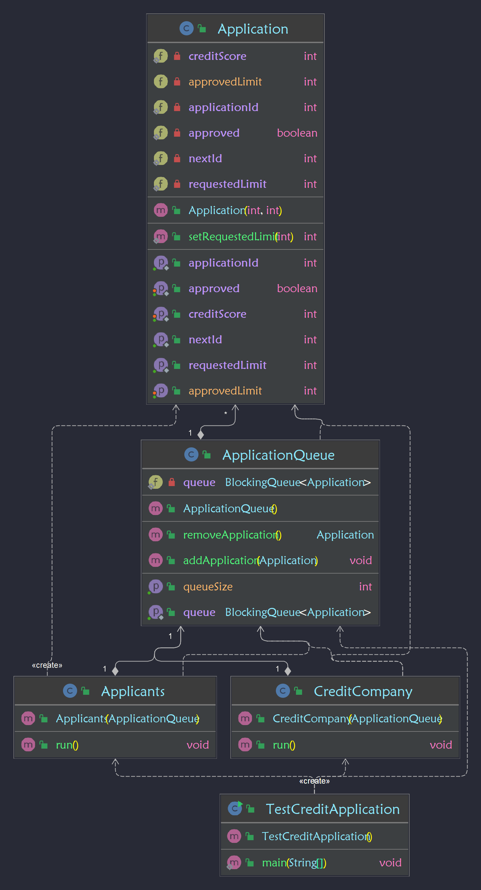

## Credit-Application-Program-Concurrency

This program simulates a loan application process using concurrency in Java. It includes several classes:
## Application

This class represents the loan application with credit score and requested loan amount as parameters. It has various getter and setter methods to access and update the credit score, requested limit, application ID and approval status.
## ApplicationQueue

This class implements a blocking queue to store the loan applications. It has methods to add and remove applications from the queue, and to check the size of the queue.
## CreditCompany

This class implements the Runnable interface to simulate a credit card company thread. It retrieves applications from the shared queue, performs logic on the applications based on the applicant's credit score and returns and removes the credit card company's response to the loan application.
## TestCreditApplication

This is the driver class that creates 3 producer threads and 2 consumer threads. The producer threads add loan applications to the shared queue and the consumer threads retrieve and process the applications from the shared queue.

In order to run the program, you can run the main method in the TestCreditApplication class.
Please note that the code was provided as is and there are some bugs, issues and questions mentioned in the comments.

